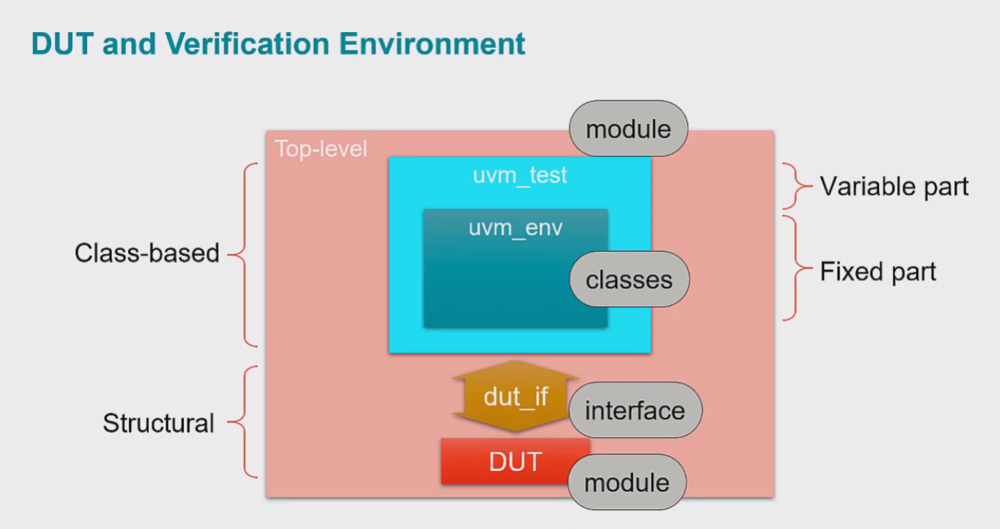

# UVM basics

## Schematic


### DUT & Interface (`DUT` and `dut_if`)
#### Interface
Ports into the DUT
```systemverilog
interface dut_if();
    ...
endinterface: dut_if
```

#### DUT
Design under test
```systemverilog
module dut(dut_if _if);
    ...
endmodule: dut
```

#### DUT Instantiation
```systemverilog
module top;
    ...
    dut_if dut_if1();
    dut    dut1(._if(dut_if1));
    ...
endmodule: top
```

### Environment (`uvm_env`)
```systemverilog
class my_env extends uvm_env;
    // Macro
    `uvm_components_utils(my_env) 

    // Constructor
    function new(string name, uvm_component parent);
        super.new(name, parent);
    endfunction: new

    function void build_phase(uvm_phase phase);
        // Instantiate components
        super.build_phase(phase);
    endfunction: build_phase

    task run_phase(uvm_phase phase);
        // Refer to next section
    endtask: run_phase

endclass: my_env
```

#### Run phase
Tests are start and stopped using **objections** inside the `run_phase` method.
- 1st objection has to be  raised when time = 0
- Test ends when all objections are dropped

```systemverilog
task run_phase(uvm_phase phase);
    phase.raise_objection(this);
    #10;
    phase.drop_objection(this);
endtask: run_phase
```

### Test (`uvm_test`)
```systemverilog
class my_test extends uvm_test;
    `uvm_component_utils(my_test)

    // Declare environment
    my_env my_env_h;

    // Constructor
    function new(string name, uvm_component parent);
        super.new(name, parent);
    endfunction: new   

    // Build phase
    function void build_phase(uvm_phase phase);
        my_env_h = my_env::type_id::create("my_env_h", this);
        // my_env -> class
        // type_id -> method/attribute
        // create -> method of the type_id type
        // "my_env_h" -> name
        // this -> parent
    endfunction: build_phase

endclass: my_test
```

### Package
Package `my_env` and `my_test` into a `package` for modularity.
```systemverilog
package my_pkg;
  `include "uvm_macros.svh"
  import uvm_pkg::*;

  `include "my_env.svh"  // import my_env class
  `include "my_test.svh" // import my_test class
endpackage: my_pkg
```

### Test instantiation (`top`)
Everything combined

```systemverilog
module top;
    import uvm_pkg::*;
    import my_pkg::*;

    dut_if dut_if1 ();
    dut    dut1 (._if(dut_if1));

    // Run test
    initial begin
        run_test("my_test")
    end
endmodule: top  
```